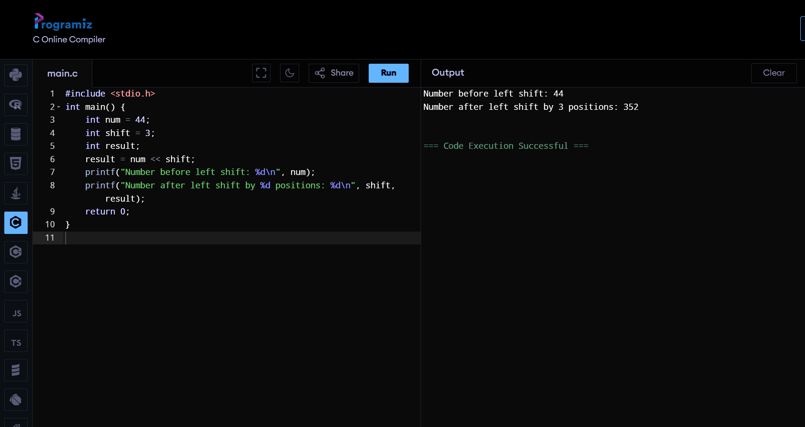
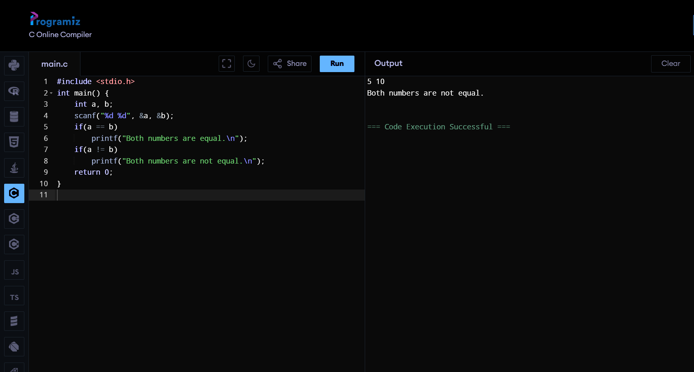
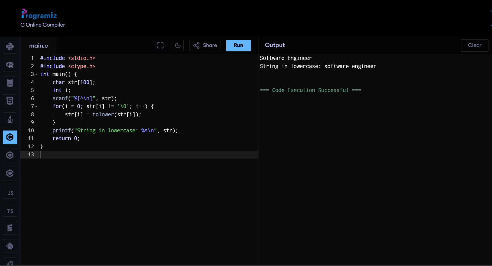
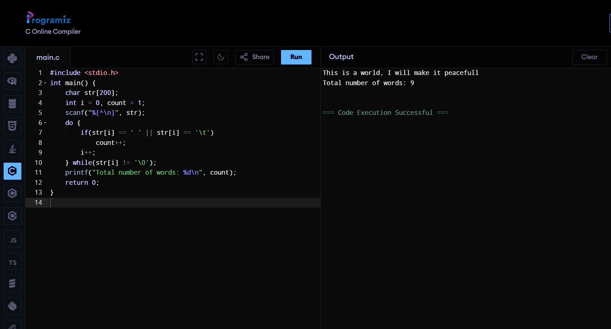
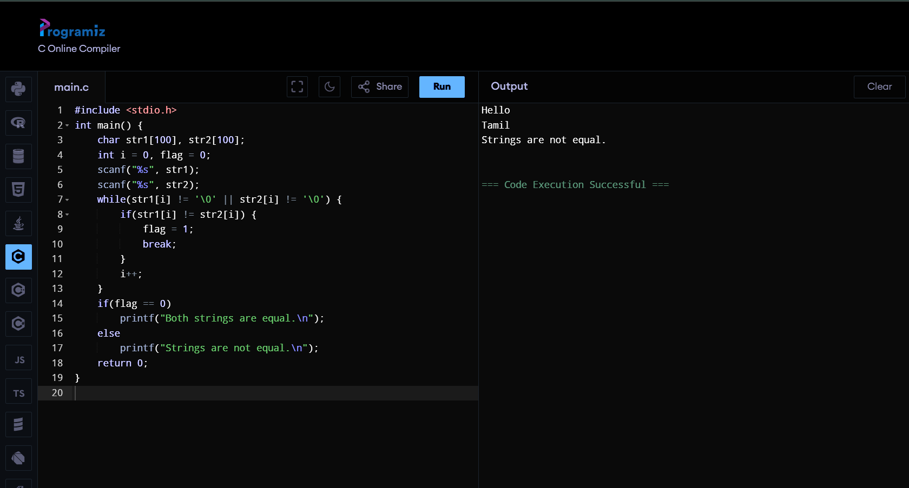

# EX-16-LEFT-SHIFT-OPERATION

## AIM

To write a C Program to perform the basic left shift operation for 44 integer number with 3 shifts.

## ALGORITHM

1. Start the program.
2. Assign values of a and b as 44 and 3.
3. Use left shift operator (<<) and shift the value of a three times.
4. Display the result.
5. Stop the program.

## PROGRAM

```
#include <stdio.h>
int main() {
    int num = 44;
    int shift = 3;
    int result;
    result = num << shift;
    printf("Number before left shift: %d\n", num);
    printf("Number after left shift by %d positions: %d\n", shift, result);
    return 0;
}

```

## OUTPUT



## RESULT

Thus the program to perform the basic left shift operation for 44 integer number with 3 shifts has been executed successfully.

# EX-17-TWO-NUMBERS-ARE-EQUAL-OR-NOT

## AIM

Write a C Program to check whether the two numbers are equal or not using simple if statement.

## ALGORITHM

1. Start the program.
2. Read two numbers.
3. If first number is equal to second number, display both are equal.
4. Otherwise display both are not equal.
5. Stop the program.

## PROGRAM

```
#include <stdio.h>
int main() {
    int a, b;
    scanf("%d %d", &a, &b);
    if(a == b)
        printf("Both numbers are equal.\n");
    if(a != b)
        printf("Both numbers are not equal.\n");
    return 0;
}
```

## OUTPUT



## RESULT

Thus the program to check whether the two numbers are equal or not using simple if statement has been executed successfully

# EX-18-STRING-LOWERCASE-CONVERSION

## AIM

Write a C Program to convert the given string into lowercase.

## ALGORITHM

1. Start the program.
2. Read a string variable.
3. Using tolower( ) function convert the given string into its lowercase.
4. Display the result.
5. Stop the program.

## PROGRAM

```
#include <stdio.h>
#include <ctype.h>
int main() {
    char str[100];
    int i;
    scanf("%[^\n]", str);
    for(i = 0; str[i] != '\0'; i++) {
        str[i] = tolower(str[i]);
    }
    printf("String in lowercase: %s\n", str);
    return 0;
}

```

## OUTPUT



## RESULT

Thus the program to convert the given string into lowercase has been executed successfully

# EX-19-COUNT-OF-WORDS-IN-A-STRING

## AIM

Write a C Program to count the total number of words in a given string using do While loop.

## ALGORITHM

1. Start the program.
2. Read a string variable.
3. Using for loop, inspect the string character by character.
4. Whenever a space is encountered increment count by 1.
5. Display the result.
6. Stop the program.

## PROGRAM

```
#include <stdio.h>
int main() {
    char str[200];
    int i = 0, count = 1;
    scanf("%[^\n]", str);
    do {
        if(str[i] == ' ' || str[i] == '\t')
            count++;
        i++;
    } while(str[i] != '\0');
    printf("Total number of words: %d\n", count);
    return 0;
}

```

## OUTPUT



## RESULT

Thus the program to count the total number of words in a given string using do While loop has been executed successfully

# EX -20 -COMPARING TWO STRINGS

## AIM

write a Program to compare two strings without using strcmp().

## ALGORITHM

Step 1: Start the program.
Step 2: Declare two character arrays c1 and c2 of size 100 to store the strings. Also, declare an integer variable
flag and initialize it to 0, and i for indexing.  
Step 3: Read the first string c1 using scanf("%[^\n]", c1); — this reads input until a newline is encountered
(i.e., can include spaces).
Step 4: Read the second string c2 using scanf("%s", c2); — this reads input until a space or newline (i.e., no
spaces in the second string).
Step 5: Start comparing characters of both strings from index i = 0.
Step 6: Repeat the following while neither c1[i] nor c2[i] is '\0' (i.e., end of string):
• If c1[i] is not equal to c2[i], set flag = 1.
• Increment i by 1.
Step 7: After the loop, check the value of flag:
• If flag == 0, print "strings are same".
• Otherwise, print "strings are not same".
Step 8: End the program.

## PROGRAM

```
#include <stdio.h>
int main() {
    char str1[100], str2[100];
    int i = 0, flag = 0;
    scanf("%s", str1);
    scanf("%s", str2);
    while(str1[i] != '\0' || str2[i] != '\0') {
        if(str1[i] != str2[i]) {
            flag = 1;
            break;
        }
        i++;
    }
    if(flag == 0)
        printf("Both strings are equal.\n");
    else
        printf("Strings are not equal.\n");
    return 0;
}

```

## OUTPUT



## RESULT

Thus the C Program to compare two strings without using strcmp() has been executed successfully.
